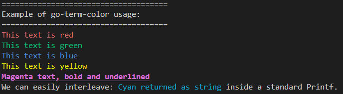

# go-term-color

[](https://pkg.go.dev/github.com/craftions/go-term-color)
[](https://github.com/craftions/go-term-color)

`go-term-color` is a pure, lightweight, and modern Go library for terminal text coloring. 

## 1. Overview

Unlike legacy libraries that bundle heavy OS-specific dependencies (such as `go-colorable` or `go-isatty`), `go-term-color` is designed strictly as a pure ANSI injection engine. It remains entirely agnostic to the operating system's underlying rendering mechanics and delegates cross-platform terminal detection entirely to our foundational library, [`go-term-check`](https://github.com/craftions/go-term-check). 

This clear separation of concerns ensures your application remains lean, predictable, and tightly adheres to Clean Architecture principles.



## 2. Project Structure

The project has been physically refactored to enforce single-responsibility principles across the codebase:

- `attribute.go`: Defines the core `Attribute` types and ANSI constants (e.g., `Reset`, `FgRed`, `BgBlack`).
- `style.go`: Contains the `Color` struct and the chainable `New()` and `Add()` methods.
- `sequence.go`: Encapsulates the internal ANSI sequence concatenation and private `render()` logic.
- `output.go`: Provides the `io.Writer` compliant printing family (`Fprint*`), safe formatting (`Sprint*`), and global helpers.
- `config.go`: Houses the robust configuration engine evaluating `NO_COLOR`, modes, and environment state.
- `terminal.go`: Defines the `TerminalDetector` interface for mockable, agnostic terminal detection.
- `diagnostic.go`: Exposes auditing tools to introspect the internal state of the color engine.

## 3. Basic Usage & Formatting

The library provides easy-to-use helpers for standard output, as well as powerful struct-based composition for complex styling.

### Quick Output Helpers
```go
package main

import "github.com/craftions/go-term-color"

func main() {
	// Directly print to stdout with a newline
	color.Red("This is a critical error message")
	
	// Format strings safely
	msg := color.GreenString("System %s is online", "Alpha")
	fmt.Println(msg)
}
```

### Composing Styles
```go
// Combine foreground colors, backgrounds, and text formatting
c := color.New(color.FgCyan, color.Bold, color.Underline)

// Safe String Formatting (Sprintf interprets '%', Sprint does not)
formatted := c.Sprintf("Progress: %d%%", 100)
literal := c.Sprint("Progress: 100%")

// Write directly to any io.Writer
c.Fprintln(os.Stdout, "This is printed via a standard io.Writer")
```

## 4. Configuration & Modes

`go-term-color` intelligently decides when to apply ANSI sequences. Color is automatically **disabled** if any of the following are true:

1. The `NO_COLOR` environment variable is set (respecting the [no-color.org](https://no-color.org) standard).
2. The `TERM` environment variable is set to `dumb`.
3. The output stream (`os.Stdout`) is piped or redirected to a file (not a TTY).

You can also force the behavior application-wide:
```go
color.CurrentMode = color.ModeAlways // Force colors
color.CurrentMode = color.ModeNever  // Disable colors entirely
color.CurrentMode = color.ModeAuto   // Default smart detection
```

## 5. Diagnostics

To aid in debugging in complex or containerized environments, `go-term-color` provides a built-in diagnostic tool. This allows developers to introspect *why* colors are enabled or disabled without actually printing raw ANSI sequences.

```go
import "github.com/craftions/go-term-color"

// Print a formatted diagnostic report to any io.Writer
color.PrintDiagnostic(os.Stdout)

// Or retrieve the struct programmatically for logging
diag := color.Diagnose()
fmt.Printf("Is color enabled? %t. Reason: %s\n", diag.ColorEnabled, diag.Reason)
```

## 6. Testing Strategy

This repository maintains a strict **100% test coverage** standard. 

We achieve this through advanced architectural mocking:
- Global functions like `Fprint` and `Fprintf` are tested safely using `bytes.Buffer` to avoid corrupting standard output.
- OS-level terminal detection is isolated via the `TerminalDetector` interface, allowing us to use *fake* implementations to reliably test TTY and `NO_COLOR` logic across all execution branches.
